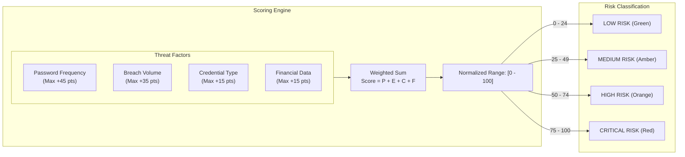

# Cybersecurity Architecture & Technical Concepts Report
**Project:** Digital Footprint Exposer — Security Self-Audit Platform  
**Target Domain:** Application Security, Applied Cryptography, Identity & Threat Intelligence  
**Author:** Antigravity AI Security Engineering  

---

## Executive Summary

The **Digital Footprint Exposer** is an educational and diagnostic application designed to evaluate user exposure across known security incidents and password compilations without compromising user privacy during the evaluation process.

A core challenge in threat intelligence tools is the **Auditor's Paradox**: *How can an auditing tool verify whether a secret (such as a password) is compromised without collecting, storing, or exposing the secret itself?*

This system resolves this paradox by pairing **Client-Side Cryptographic Hashing**, the **$k$-Anonymity Range Query Model**, **Differential Privacy Padding**, and **Multi-Vector Risk Quantification**.

```mermaid
flowchart TD
    subgraph Client["Client Browser (Zero-Knowledge Zone)"]
        PW["Plaintext Password"] -->|Web Crypto API| SHA["Full SHA-1 (40 hex chars)"]
        SHA -->|Split| P5["Prefix (5 hex chars)"]
        SHA -->|Split| S35["Suffix (35 hex chars)<br/><i>Never leaves memory</i>"]
    end

    subgraph Server["Backend Proxy (Node.js/Express)"]
        P5 -->|GET /api/pwned-password/:prefix| Proxy["Express Router"]
    end

    subgraph Remote["Troy Hunt / HIBP Infrastructure"]
        Proxy -->|GET /range/:prefix| HIBP["HIBP Pwned Passwords Cloudflare Worker"]
        HIBP -->|16^5 Hash Bucket (~500 - 3000 suffixes)| Cache["Padded Response Payload"]
    end

    Cache --> Proxy
    Proxy -->|Payload List| Client
    Client --> Match{"Local Suffix Comparison<br/>S35 == Returned Suffixes"}
    Match -->|Found| Breach["Breach Count Displayed"]
    Match -->|Not Found| Clean["0 Breaches Detected"]
```

---

## 1. Cryptographic Principles & Privacy Preservation

### 1.1 Zero-Knowledge Client-Side Hashing

In traditional, insecure auditing tools, a password field is submitted as form data (`POST /api/check-password`) directly to a server. This violates the principle of least privilege and introduces critical liability:
- An eavesdropper or malicious proxy could intercept plaintext credentials in transit.
- Backend server logs or process memory could inadvertently record live user passwords.
- Compromise of the auditor becomes a credential exfiltration event.

**Implementation in the System:**
The system uses the native browser [Web Crypto API](file:///d:/cybersec/frontend/src/utils/crypto.js) (`crypto.subtle.digest('SHA-1', ...)`). The plaintext password exists solely within transient memory in the user's browser runtime and is destroyed upon garbage collection.

```javascript
// Native cryptographic execution in browser runtime
const encoder = new TextEncoder();
const data = encoder.encode(password);
const hashBuffer = await crypto.subtle.digest('SHA-1', data);
const hexString = Array.from(new Uint8Array(hashBuffer))
  .map(b => b.toString(16).padStart(2, '0'))
  .join('').toUpperCase();
```

---

### 1.2 The $k$-Anonymity Mathematical Model

**$k$-Anonymity** was originally introduced by Latanya Sweeney and Pierangela Samarati (1997) as a formal model for protecting individual privacy in released datasets. A release provides $k$-anonymity if each individual's information cannot be distinguished from at least $k - 1$ other individuals whose information also appears in the release.

In 2017, security researcher Troy Hunt adapted this concept to password auditing in the *Have I Been Pwned* (HIBP) Pwned Passwords v2 service.

#### Mathematical Foundation:
1. A standard `SHA-1` digest yields a 160-bit integer, conventionally represented as a 40-character hexadecimal string ($16^{40}$ permutations).
2. The hash is partitioned into two segments:
   - **Prefix:** First 5 characters ($16^5 = 1,048,576$ possible buckets).
   - **Suffix:** Remaining 35 characters ($16^{35} \approx 7.0 \times 10^{41}$ permutations).
3. The client queries **only** the 5-character prefix:
   $$\text{Endpoint: } \texttt{GET /range/}\{\text{SHA-1}[0..4]\}$$
4. The API returns all known compromised hash suffixes sharing that specific 5-character prefix (typically between 500 and 3,000 distinct entries), along with their occurrence counts.
5. The client performs an in-memory lookup over this returned set for its 35-character suffix.

$$\text{Information Disclosed to Network} = \log_2(16^5) = 20 \text{ bits}$$
$$\text{Entropy Retained Locally} = 160 - 20 = 140 \text{ bits}$$

Because $140$ bits of entropy remain strictly within the client, it is mathematically infeasible for the backend server, an ISP, or HIBP to reverse-engineer which of the hundreds of returned suffixes belongs to the user.

---

### 1.3 Protection Against Side-Channel Traffic Analysis (Differential Padding)

An attacker monitoring network packets could theoretically analyze response sizes: if a hash prefix returns an abnormally small or large payload, the attacker might narrow down the possible candidate passwords based on response length.

**Mitigation Applied:**
The backend forwards the request with the `Add-Padding: true` HTTP header:

```javascript
const response = await fetch(hibpUrl, {
  headers: {
    'User-Agent': 'DigitalFootprintExposer-SecurityAudit/1.0',
    'Add-Padding': 'true' // Injects random dummy hash suffixes
  }
});
```

When this header is present, the API introduces dummy suffix records into the output stream, flattening response size variance and preventing statistical packet-length analysis.

---

## 2. Threat Vectors Evaluated

The application addresses four major identity-centric cyberattack vectors:

| Threat Vector | Mechanism | How This App Diagnoses It |
| :--- | :--- | :--- |
| **Credential Stuffing** | Attackers take spilled username/password pairs and use automated bots (e.g., OpenBullet, SilverBullet) to test them against thousands of disparate web portals. | Detects whether an identical password or email address exists in public database dumps, signaling elevated probability of automated target matching. |
| **Password Spraying** | Rather than attempting multiple passwords against one account (which triggers lockout policies), attackers test one common password (e.g., `Spring2024!`) across thousands of accounts. | Checks password exposure count. Passwords with thousands or millions of occurrences are standard entries in dictionary spray lists. |
| **Rainbow Table / Precomputation Attacks** | Attackers use precomputed hash lookup tables for unsalted or weakly salted legacy algorithms (MD5, SHA-1). | Alerts users when breaches involve legacy hash formats (e.g., the *FinLearn* and *GameZone* incidents exposing MD5/SHA-1 dumps). |
| **Identity Correlation & Doxxing** | Aggregating fragmented data (usernames, phone numbers, GPS coordinates, purchase history) across multiple separate breaches to construct an actionable profile. | The simulated email check aggregates disparate exfiltrated fields (biometrics, OAuth tokens, financial indicators) to calculate total exposure surface. |

---

## 3. The Exposure & Risk Quantification Engine

### 3.1 Qualitative vs. Quantitative Risk Modeling

Security auditing requires synthesizing disparate data points into an actionable risk assessment. The system uses a multi-factor weighted algorithm that evaluates both the **likelihood of credential compromise** and the **criticality of exposed data**.



### 3.2 Scoring Breakdown

$$R_{\text{Total}} = \min\Big(100,\; f(P) + g(B) + S_{\text{Cred}} + S_{\text{Fin}}\Big)$$

Where:
1. **Password Exposure Function $f(P)$:**
   $$f(P) = \begin{cases} 45 & \text{if } P_{\text{count}} > 1,000,000 \\ 35 & \text{if } 1,000 < P_{\text{count}} \le 1,000,000 \\ 25 & \text{if } 0 < P_{\text{count}} \le 1,000 \\ 0 & \text{if } P_{\text{count}} = 0 \end{cases}$$

2. **Breach Volume Function $g(B)$:**
   $$g(B) = \begin{cases} 35 & \text{if matched breaches } \ge 3 \\ 20 & \text{if } 1 \le \text{matched breaches } < 3 \\ 0 & \text{if matched breaches } = 0 \end{cases}$$

3. **Data Sensitivity Modifiers:**
   - $S_{\text{Cred}} = +15$ if any breached database included plaintext passwords, bcrypt hashes, or OAuth authorization tokens.
   - $S_{\text{Fin}} = +15$ if any breached database included payment records, card numbers, billing addresses, or crypto public keys.

---

## 4. Architectural Separation: Live vs. Simulated Subsystems

A critical tenet of security software design is **transparency regarding data provenance**:

```
+-------------------------------------------------------------------------+
|                  DIGITAL FOOTPRINT EXPOSER PLATFORM                     |
+------------------------------------+------------------------------------+
|  MODULE 1: PASSWORD BREACH CHECK   | MODULE 2: EMAIL / IDENTITY CHECK   |
+------------------------------------+------------------------------------+
| • Data Source: Live HIBP REST API  | • Data Source: Local JSON Model   |
| • Protocol: k-Anonymity Range Query| • Protocol: Substring / Tag Index  |
| • Privacy: Pure Zero-Knowledge     | • Privacy: Contained Demo Dataset  |
| • Verdict: Absolute Empirical Truth| • Verdict: Simulated Attack Vectors|
+------------------------------------+------------------------------------+
```

### Why Simulated Data for Email/Username?
The public Have I Been Pwned API for email addresses (`/api/v3/breachedaccount/{account}`) is an authenticated, commercial paid service that requires proprietary API keys, enterprise rate-limiting tiers, and end-user verification procedures.

To deliver an immediate, fully functional prototype without recurring operational costs or external account dependencies, the identity lookup runs against a representative [mock breaches dataset](file:///d:/cybersec/backend/data/mockBreaches.json). This dataset models real-world incident archetypes (social networks, e-commerce stores, developer repositories, and healthcare databases).

---

## 5. Defense-in-Depth Remediation Principles

The application translates audit findings into actionable defense-in-depth security measures aligned with industry standards (e.g., **NIST SP 800-63B** *Digital Identity Guidelines*):

1. **Elimination of Password Reuse:**
   When an audit uncovers a breached password, the immediate danger is not merely the compromised service, but cross-service credential stuffing. Users must adopt dedicated password managers (e.g., Bitwarden, 1Password) to ensure unique, high-entropy (16+ character) credentials for every platform.

2. **Phishing-Resistant MFA (FIDO2 / WebAuthn):**
   Even when passwords are leaked, accounts remain protected if secondary authentication is enforced. The remediation roadmap prioritizes cryptographic hardware keys and device-bound passkeys over SMS-based OTPs, which remain vulnerable to SIM-swapping.

3. **Routine Deprovisioning & OAuth Token Auditing:**
   As demonstrated by modern SaaS breaches (e.g., the *WorkCollab* and *TechForge* incidents), attackers increasingly target third-party OAuth access tokens rather than passwords. The system instructs users to routinely revoke unused third-party application permissions in Google, GitHub, and Microsoft identity providers.

---

## 6. Summary of Technologies Used

- **Browser Crypto:** Web Crypto API (`crypto.subtle.digest`) for in-browser SHA-1 hashing.
- **Frontend Stack:** React 19, Vite, Lucide Icons, and Vanilla CSS Design Tokens (Glassmorphic Dark Mode).
- **Backend Stack:** Node.js, Express, Native `fetch` with privacy headers (`Add-Padding`).
- **Cryptographic Model:** $k$-Anonymity range queries over 20-bit prefix buckets.
